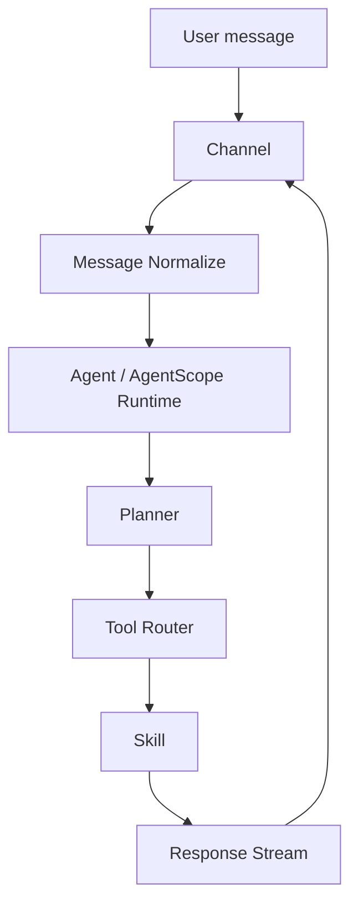

# QwenPaw Platform Architecture

## 1. Purpose

This repository is the long-term engineering home for the imported QwenPaw / AgentScope workspace. The current runtime assets remain usable in place while platform boundaries are introduced incrementally.

The architecture does not replace AgentScope. AgentScope remains the agent runtime; this project adds stable contracts around channels, messages, tools, skills, storage, and streaming.

## 2. Architecture principles

1. Preserve current behavior before extracting abstractions.
2. Prefer adapters and compatibility layers over framework rewrites.
3. Keep channel transport concerns outside agent and skill logic.
4. Give every message, tool call, and stream a stable correlation ID.
5. Keep credentials and runtime state outside Git.
6. Migrate one independently verifiable unit at a time.

## 3. Target request flow



Canonical flow:

```text
User message
    ↓
Channel
    ↓
Message Normalize
    ↓
Agent
    ↓
Planner
    ↓
Tool Router
    ↓
Skill
    ↓
Response Stream
```

The diagram is a logical boundary map, not a claim that every boundary already exists as a separate module.

## 4. Component responsibilities

### Channel

Receives and sends transport-specific payloads. A channel owns authentication, webhook or polling mechanics, acknowledgements, platform rate limits, attachment transfer, and conversion between platform payloads and the normalized message contract.

A channel must not contain planner, model, or skill business logic.

### Message Normalize

Converts Telegram, WeCom, WeChat, Console, and future channel payloads into one versioned internal message. It preserves the original payload only as quarantined metadata for diagnostics and replay.

The normalized model must cover identity, conversation, content parts, attachments, reply context, timestamps, trace IDs, and channel capabilities.

### Agent

Delegates reasoning and conversation execution to the existing QwenPaw / AgentScope runtime. Platform code may adapt configuration and events at the boundary, but must not fork or rewrite AgentScope core behavior.

### Planner

Represents planning decisions made by the runtime. Initially this may remain an internal AgentScope behavior. A platform interface is introduced only when there is a verified consumer, such as observability, approvals, or deterministic execution plans.

### Tool Router

Resolves a requested tool to a built-in tool, MCP client, or workspace Skill. It is responsible for policy checks, input validation, timeouts, cancellation propagation, tracing, and normalized errors.

### Skill

Packages a reusable capability with metadata, schemas, execution code, tests, and documentation. Existing `SKILL.md` based Skills remain supported through a compatibility loader while the engineering contract is adopted skill by skill.

### Response Stream

Emits a transport-neutral sequence of lifecycle, text, tool, artifact, warning, and error events. Channel adapters decide whether to stream, edit an existing message, buffer, or send a final response based on platform capabilities.

## 5. Directory ownership

| Directory | Responsibility | Current migration rule |
| --- | --- | --- |
| `apps/` | Runnable applications and deployment composition | Skeleton only until entrypoints are identified |
| `core/` | Stable internal contracts and orchestration adapters | Do not copy AgentScope internals here |
| `channels/` | Transport adapters | Keep empty until an adapter is migrated and tested |
| `skills/` | Existing and future Skills | Preserve all 17 existing Skills in place |
| `configs/` | Agent, Skill, MCP, and operational configuration | Preserve current agent configuration; keep secrets ignored |
| `docs/` | Architecture, status, standards, and roadmap | Source of truth for platform direction |
| `tests/` | Cross-component contract and integration tests | Skeleton until contracts are introduced |
| `memory/`, `sessions/`, `mem_*`, `checkpoints/` | Runtime and historical state | Preserve locally; do not commit sensitive content |
| `drivers/` | Exported external tool drivers | Keep Tavily MCP driver unchanged during baseline work |
| `digest/` | Exported operational knowledge | Preserve as migration evidence and runbooks |

## 6. Compatibility strategy

The current workspace remains the compatibility baseline. New platform modules call existing behavior through adapters; they do not require existing Skills or configuration files to move immediately.

For every migration unit:

1. Capture current input and output behavior with a fixture or contract test.
2. Introduce a boundary adapter without changing the underlying implementation.
3. Run old and new paths against the same fixture.
4. Switch one caller only after parity is demonstrated.
5. Keep a rollback path until the next release boundary.

## 7. Errors and observability

Errors cross boundaries as structured failures with `code`, `message`, `retryable`, `source`, and `trace_id`. Raw secrets, tokens, full credentials, and private message bodies must not be written to logs.

Every request should eventually carry:

- `message_id`
- `conversation_id`
- `trace_id`
- `channel`
- `agent_id`
- `tool_call_id` when applicable
- stream sequence number when applicable

## 8. Architecture guardrails

- Do not modify PDF Editor during platform baseline work.
- Do not move existing Skills in a bulk operation.
- Do not introduce channel-specific conditions into Agent logic.
- Do not require streaming support from every channel.
- Do not store credentials in versioned configuration.
- Do not claim a configured channel is operational until an end-to-end test passes.
