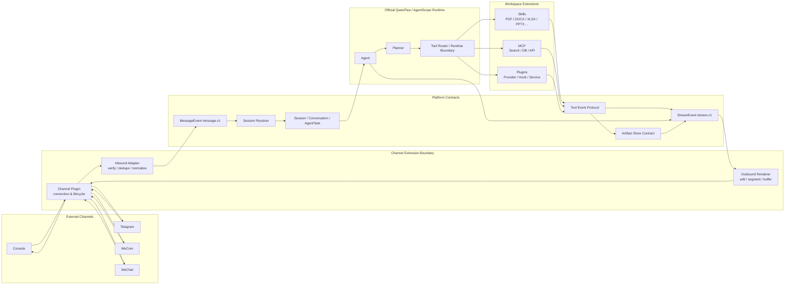

# QwenPaw Platform Architecture V2

## 1. 目标与边界

Architecture V2 将统一消息、Session、Extension、Tool Event 和 Streaming 设计放到一张边界图中。

这是目标架构，不是当前实现清单：

- 官方 QwenPaw/AgentScope Runtime 继续负责 Agent、Planner 与既有 Tool 调度；
- 本仓库负责 Workspace、Skills、Configs、Extensions、Adapters、协议和文档；
- 当前 Channel、PDF Editor、Agent 配置和 Runtime 均不因本设计改变；
- 真实 Channel 只有在后续契约测试和 Cloud staging 通过后才接入。

## 2. 总体关系图



图中的 Runtime Boundary 是适配边界，不要求复制、fork 或重写 AgentScope 核心。若官方 Runtime 暂时只能给出最终文本或粗粒度 Tool 结果，兼容 Adapter 仍可产生最小合法事件序列。

## 3. 组件职责

| 组件 | 负责 | 不负责 |
| --- | --- | --- |
| Channel Plugin | Provider 连接、凭据引用、webhook/polling、生命周期、健康状态 | Agent 业务逻辑、Skill 选择 |
| Inbound Adapter | 验签后的 payload 解码、去重、附件入库、`MessageEvent` 转换 | 调用模型、跨渠道自动合并身份 |
| Session Resolver | Identity、Session、Conversation 与 AgentTask 解析 | Provider API 调用、Memory 内容生成 |
| Agent/Planner | 由官方 Runtime 执行推理、计划和能力选择 | Channel 消息编辑、Provider 限流 |
| Tool Router Boundary | 把 Runtime Tool/Skill/MCP 调用映射为统一 Tool Event | 重写现有 Tool/Skill 实现 |
| Skill | 用户任务与文件/AI 工作流 | Runtime Hook、Channel 协议 |
| Plugin | Runtime/Provider/系统服务增强 | 代替纯任务型 Skill |
| MCP | 外部搜索、数据库和 API 工具协议 | Channel 会话管理 |
| Artifact Store Contract | 受控文件引用、校验、权限、生命周期 | 向 Channel 决定展示文本 |
| Stream Coordinator | 排序、重放、背压、合并和终态 | 伪造 Tool 进度、暴露思维链 |
| Outbound Renderer | 将统一事件渲染为实时、编辑、分段或最终消息 | 修改 Agent 答案、执行 Skill |

## 4. 三条主流程

### 4.1 入站消息

```text
Provider payload
  → Channel Plugin 验证连接与签名
  → Inbound Adapter 去重、下载并登记附件
  → MessageEvent(message.v1)
  → Session Resolver
  → Session + Conversation + AgentTask
  → Official Runtime Agent
```

未通过校验的 payload 在边界终止，不进入 Agent。原始 Provider 字段只保留为受控诊断引用。

### 4.2 Tool/Extension 执行

```text
Agent / Planner
  → Runtime Tool Router
  → Skill | MCP | callable Plugin | builtin tool
  → tool.start / tool.progress* / file.created* / tool.result|tool.error
  → StreamEvent
```

PDF Editor 在 Skill 阶段接入。未来由边界 Adapter 映射进度与结果，不修改 PDF Editor 本身。MCP Server 不支持进度时只产生开始和终态。

### 4.3 输出交付

```text
Agent + Tool Events
  → ordered StreamEvent(stream.v1)
  → Channel capability selection
  → Console realtime | Telegram edit | WeCom segments | WeChat buffer/follow-up
  → Provider delivery receipt
```

`agent.done` 保存权威最终文本与 Artifact 引用，因此所有 Channel 都可以安全退化为 final-only。

## 5. Extension 类型如何协作

| 类型 | V2 接入点 | 示例 |
| --- | --- | --- |
| Skill | Tool Router 之后，产生 Tool Event 和 Artifact | `pdf-editor`、`docx`、`xlsx`、`pptx` |
| Plugin | Channel 生命周期、Runtime Hook、Provider 或可调用服务 | Telegram/WeCom Channel Plugin、企业审计 Plugin |
| Adapter | Provider↔Message、Tool output↔Tool Event、Stream↔Provider message | Telegram Update Adapter、PDF Editor Event Adapter |
| MCP | Tool Router 之后的外部工具协议 | Tavily 搜索、数据库、企业 API |

Extension 分类不改变官方 Runtime 所有权。一个 Channel 通常由 Plugin 管连接、Adapter 管数据转换；一个“生成报告”能力通常由 Skill 编排 MCP，而不是塞入 Channel Plugin。

## 6. 协议关联键

```text
MessageEvent.id
  └─ trace_id
      └─ AgentTask.task_id
          ├─ stream_id → event_id + sequence
          ├─ tool_call_id → parent_tool_call_id
          └─ artifact_id
```

- `trace_id` 用于端到端审计，不作为权限凭据。
- `message_id` 确保入站幂等；`event_id` 确保流式重放幂等。
- `task_id` 区分明确重试；`tool_call_id` 区分每次 Tool 执行。
- `artifact_id` 只引用受控存储，不泄漏文件系统路径。

## 7. Runtime 与仓库所有权

| 边界 | 官方 Runtime 所有 | 当前仓库所有/规划所有 |
| --- | --- | --- |
| Agent 执行 | Agent、Planner、官方 Tool/Skill 加载与运行循环 | 配置、Workspace Skill、兼容 Adapter、契约测试 |
| Channel | 官方已提供或云端托管的 Runtime 能力 | 恢复后的企业 Plugin/Adapter、非敏感配置、测试 |
| Extension | 官方安装和加载机制 | Skill/Plugin/Adapter/MCP 源码、版本和发布物 |
| Streaming | 官方可用的原始执行输出 | `stream.v1` 目标契约、Collector/Renderer（未来） |
| State | Runtime 的实际 Session/Memory 机制 | 导出数据保护、目标模型、未来兼容与迁移工具 |

本仓库不建立“自制 Runtime”来替代官方部署。协议实现必须通过官方固定版本的 Cloud staging 验证。

## 8. 渐进迁移路径

1. **契约冻结**：评审本批文档，后续再生成 schema 与 fixture；此时不接入 Runtime。
2. **Console 参考路径**：用脱敏 fixture 构建纯转换和 Collector 测试，不改变现有 Console 启动方式。
3. **Runtime Boundary Adapter**：把官方最终输出映射为最小 Stream 序列，验证最终文本完全一致。
4. **Tool Event Adapter**：逐个适配现有 Tool；先采用 start/result，确认稳定后再增加可靠 progress。
5. **Channel staging**：Telegram、WeCom、WeChat 分别在禁用默认配置和测试账号下接入 Renderer。
6. **逐渠道发布**：每个 Channel 独立版本、测试、回滚，不一次性切换所有入口。

每一步都保留旧路径，只有对比测试与 Cloud staging 通过后才切换单个调用方。

## 9. 安全与架构约束

- 不在 Message/Stream/Tool Event 中存储凭据、原始思维链、内部堆栈和不受控路径。
- 不根据昵称或模型推测跨 Channel 合并用户。
- 不要求所有 Channel 支持 token streaming；Renderer 必须可退化到最终输出。
- 不把 Channel 限流、编辑和被动回复约束放进 Agent/Skill。
- 不为获得进度而解析不稳定日志或修改 PDF Editor。
- 不在本阶段修改 Channel、Agent 配置、Runtime、PDF Editor 或 Streaming 业务代码。

## 10. V2 设计文档索引

- `MESSAGE_MODEL_DESIGN.md`：统一入站 `MessageEvent`。
- `SESSION_MODEL.md`：User、Channel、Session、Conversation、AgentTask。
- `TOOL_EVENT_PROTOCOL.md`：Skill/MCP/Plugin/builtin tool 生命周期。
- `STREAMING_ARCHITECTURE.md`：统一 StreamEvent 与 Channel Renderer。
- `EXTENSION_ARCHITECTURE.md`：Skill、Plugin、Adapter、MCP 分类与版本规则。
