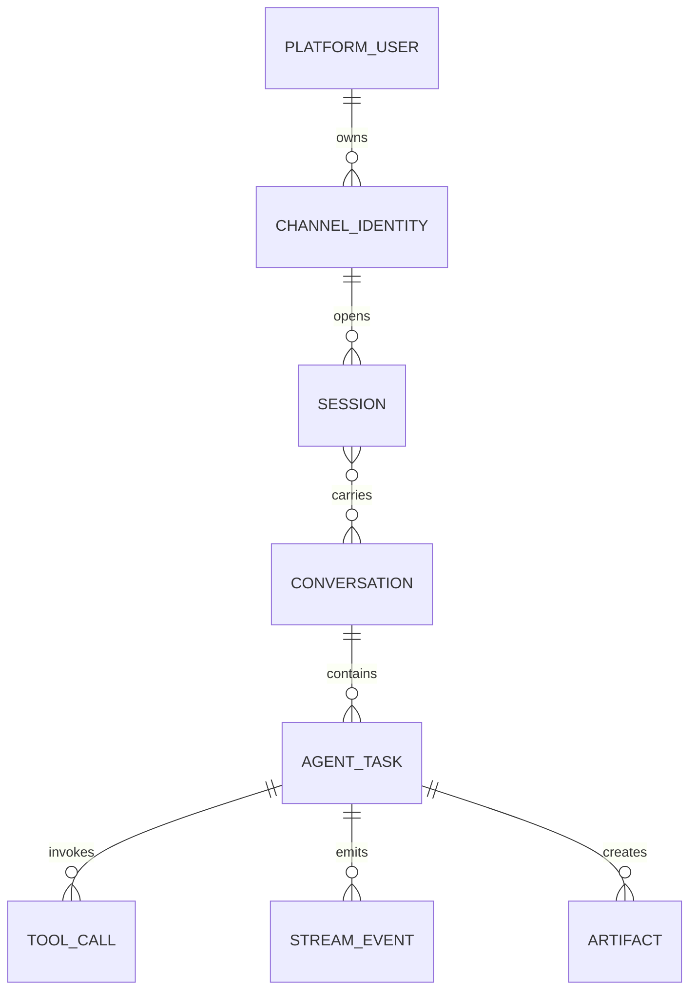

# 统一 Session 模型

## 1. 文档定位

本文定义跨 Channel 的身份、会话、对话和执行任务边界。它是目标数据模型，不迁移现有 `sessions/`、`memory/`，不修改 Agent 配置或 Runtime 会话实现。

```text
User
  ↓ through a verified Channel identity
Channel
  ↓ resolves transport scope
Session
  ↓ contains one or more topics
Conversation
  ↓ starts an execution
Agent Task
```

## 2. 核心实体

### 2.1 PlatformUser

平台内部稳定主体。它不等同于 Telegram user id、WeCom external_userid、微信 OpenID 或 Console 显示名。

最低字段：

- `user_id`
- `status`
- `tenant_id`（企业场景必需）
- `created_at`、`updated_at`

### 2.2 ChannelIdentity

一个 PlatformUser 在特定 Channel 实例中的已验证身份。

唯一键建议：

```text
(channel_type, instance_id, tenant_id, external_user_id)
```

它保存绑定状态、验证方式和最少 Provider 标识，不保存凭据。显示名、手机号昵称等可变属性绝不作为合并依据。

### 2.3 Session

传输范围内的连续交互容器。Session 默认属于一个 Channel 实例和一个对话位置，例如私聊、群、Telegram topic 或客服会话。

最低字段：

- `session_id`
- `channel_identity_id`
- `channel_type`、`instance_id`、`tenant_id`
- `scope_type`：`direct`、`group`、`thread`、`console`
- `scope_external_id`
- `state`：`active`、`idle`、`closed`、`archived`
- `last_activity_at`

### 2.4 Conversation

用户可理解的逻辑话题或上下文单元。一个 Session 可包含多个 Conversation，例如执行 `/new` 后创建新话题；一个经过显式授权的 Conversation 也可以在另一个 Channel Session 中恢复。

最低字段：

- `conversation_id`
- `owner_user_id`、`tenant_id`
- `title`（可选）
- `state`：`active`、`closed`、`archived`
- `memory_policy`、`retention_policy`
- `created_at`、`updated_at`

Session 与 Conversation 通过带时间和权限信息的关联表连接，而不是把两者当作同一个 ID。

### 2.5 AgentTask

一次用户请求对应的一次 Agent 执行。重投相同消息不会创建新 Task；明确重试会创建新 Task 并关联原 Task。

最低字段：

- `task_id`
- `conversation_id`、`session_id`
- `message_id`、`trace_id`、`stream_id`
- `agent_id`
- `status`：`queued`、`running`、`succeeded`、`failed`、`cancelled`
- `started_at`、`finished_at`
- `retry_of`（可选）

Tool Call 和 Artifact 归属于 AgentTask；它们不直接定义 Session。

## 3. 关系模型



关键区分：

- User 解决“是谁”；
- ChannelIdentity 解决“在该 Provider 上是谁”；
- Session 解决“从哪里、在什么传输范围继续”；
- Conversation 解决“正在讨论哪个话题”；
- AgentTask 解决“本次具体执行是什么”。

## 4. Channel Session 映射

| Channel | Identity 范围 | Session 范围建议 | 注意事项 |
| --- | --- | --- | --- |
| Console | 本地/登录账号 + Console 实例 | Console 会话或显式 session 参数 | 匿名 Console 身份不可自动与企业账号合并 |
| Telegram | bot instance + Telegram user | direct: chat；group: chat + user；topic: chat + thread + user | 同一用户在不同 bot 实例中是不同 ChannelIdentity；群和私聊分离 |
| WeCom Bot | corp/tenant + bot instance + user | conversation/group/thread Provider scope | 企业租户强隔离；不能只用昵称或手机号推断身份 |
| WeCom KF | corp + open_kfid + external_userid | 客服会话或最近有效接待范围 | callback/polling 重投必须落入同一 Session |
| WeChat | app/account + OpenID/UnionID（按授权） | 公众号/机器人会话范围 | OpenID 跨应用通常不同；只有可靠、合规的绑定才能关联 |

## 5. 多渠道统一会话策略

默认策略是隔离，不是自动合并。

### 5.1 身份绑定

两个 ChannelIdentity 只有通过以下方式之一才能归属同一 PlatformUser：

- 登录态/企业 SSO 明确证明；
- 一次性绑定码在两个 Channel 中完成确认；
- 管理员在有审计记录和授权的情况下绑定；
- Provider 提供且企业策略允许使用的可靠联合身份。

不得基于昵称、头像、自然语言自称、相似手机号尾号或模型推测绑定。

### 5.2 Conversation 恢复

身份绑定完成也不自动合并 Session 或历史消息。跨 Channel 继续某个 Conversation 需要用户明确选择：

1. 用户在目标 Channel 发起“继续对话”；
2. 系统展示可恢复 Conversation 的最小安全摘要；
3. 用户确认；
4. 创建目标 Session 到 Conversation 的授权关联；
5. 后续 AgentTask 使用新的 Session，但沿用 `conversation_id`。

群聊 Conversation 默认不可转入私聊，私聊也不可自动暴露到群聊。企业租户之间永不转移 Conversation。

## 6. 生命周期

### Session

```text
active → idle → active
   └────→ closed → archived
```

- `idle` 只表示传输暂时无活动，不清空 Conversation。
- `closed` 停止新消息进入该 Session，但不立刻删除历史。
- `archived` 遵守留存策略，默认只读。

### Conversation

- 新 Session 默认创建或选择一个 active Conversation。
- `/new`、UI 操作或策略可关闭当前 Conversation 并创建新 Conversation。
- 删除/遗忘请求按 tenant、审计、法规和 Artifact 引用规则执行，不通过简单删除目录模拟。

### AgentTask

`queued → running → succeeded | failed | cancelled`。同一入站 `message_id` 只能绑定一个初始 AgentTask；显式重试使用新 Task 并设置 `retry_of`。

## 7. Memory 与 Session 的边界

- Session 是路由与连续交互边界；Memory 是 Agent 可读取的持久知识或上下文策略。
- Conversation 可以引用 Memory snapshot/version，但不直接把 `memory/` 文件路径暴露给 Channel。
- 跨 Channel 恢复时沿用 Conversation 的允许上下文，不复制整个 Session 的 Provider metadata。
- 当前导出的 `memory/`、`sessions/` 保持原状；未来实现需要兼容 Adapter 和迁移审计，禁止直接改写历史数据。

## 8. 安全、租户与留存

- 所有查询至少按 `tenant_id + user_id/conversation_id` 授权，不能只按可猜测的 ID 查询。
- ChannelIdentity、Session 与 Conversation 的绑定/解绑都写审计事件。
- 原始 Provider ID 仅在需要投递和审计的边界保存，并按策略加密或散列。
- 消息、Tool 结果、Artifact、Stream Event 可有不同留存周期，但必须能通过 `trace_id/task_id` 审计。
- 解绑 ChannelIdentity 不自动删除 Conversation；删除、导出和遗忘采用独立合规流程。

## 9. 设计验收标准

1. 同一 PlatformUser 可绑定多个 ChannelIdentity，但默认 Session 相互隔离。
2. 同一 Conversation 只有在显式验证和确认后才能跨 Channel 恢复。
3. 群聊、私聊、不同 tenant 和不同 Channel 实例不会被错误合并。
4. Provider 重投同一消息不会产生重复 AgentTask。
5. Session/Memory/Conversation 各自职责明确，当前运行态数据无需修改。
